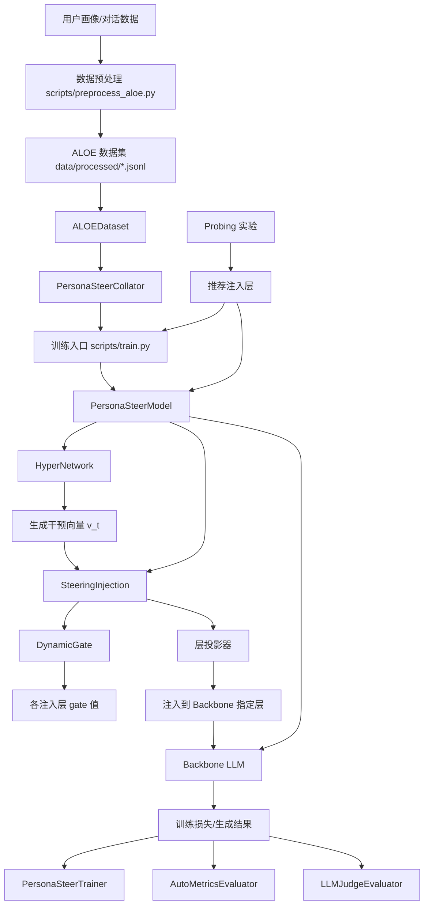

# PersonaSteer 项目架构关系图说明

日期：2026-04-12
最后验证日期：2026-04-12
状态：基于当前仓库代码与文档整理

## 1. 文档目的

本文用于说明 PersonaSteer 项目的整体架构、模块职责、调用关系与关键数据在模块间的流转方式，帮助新进入项目的成员快速建立全局认知。

## 2. 项目定位

PersonaSteer 是一个围绕“人格可控多轮对话”的研究型工程仓库。它的核心不是构建聊天前端，而是验证并迭代一种动态激活引导机制：

1. 从用户画像、用户当前输入或上下文中提取人格相关信息；
2. 通过 HyperNetwork 生成干预向量 `v_t`；
3. 在骨干大语言模型的指定隐藏层注入该向量；
4. 通过动态门控控制注入强度；
5. 观察多轮对话中人格一致性、自然度与综合质量是否提升。

核心实现入口位于 `src/models/persona_steer.py:52`。

## 3. 顶层目录与职责

| 目录 | 作用 |
| --- | --- |
| `src/` | 核心源码，包含数据、模型、训练、评估、probing |
| `scripts/` | 训练、评估、推理、数据预处理、批处理、实验辅助脚本 |
| `configs/` | 各阶段训练与评估配置 |
| `data/` | 原始数据、预处理结果、数据划分结果 |
| `checkpoints/` | 各实验阶段模型权重 |
| `results/` | 生成结果、评估产物 |
| `logs/` | 训练与评估日志 |
| `docs/` | 设计、分析、指南、历史记录 |
| `Qwen/` | 本地模型目录 |
| `tests/` | 当前工作区内可见的测试代码 |

## 4. 架构总览图（文字版）



## 5. 核心模块关系

### 5.1 数据层

#### `src/data/aloe_dataset.py:13`
`ALOEDataset` 负责：
- 读取处理后的 `jsonl` 数据；
- 解析用户画像、人格标签、历史对话等字段；
- 按训练/评估场景组织单条样本。

#### `src/data/collator.py:11`
`PersonaSteerCollator` 负责：
- 使用 tokenizer 对样本批量编码；
- 对输入序列做 padding、mask 构建与 batch 对齐；
- 组织训练器可直接消费的张量批次。

### 5.2 模型层

#### `src/models/persona_steer.py:20`
`PersonaSteerConfig` 定义模型关键参数，包括：
- `inject_layers`
- `v_dim`
- `hidden_dim`
- `layer_dim`
- `gate_hidden_dim`
- `dropout`
- `backbone_model_name`
- `encoder_model_name`

#### `src/models/persona_steer.py:52`
`PersonaSteerModel` 是系统中最核心的装配器，负责：
- 持有 backbone 模型；
- 持有 encoder；
- 创建 `HyperNetwork`；
- 创建 `SteeringInjection`；
- 在 backbone 指定层上注册 forward hook；
- 在 `forward` 与 `generate` 中串联完整 steering 逻辑。

关键方法：
- `forward`：`src/models/persona_steer.py:234`
- `generate`：`src/models/persona_steer.py:305`

### 5.3 干预向量生成层

#### `src/models/hyper_network.py:14`
`HyperNetwork` 负责：
- 接收人格文本、用户查询文本和可能的历史状态；
- 调用 encoder 提取语义表示；
- 经过多层 MLP 或带层嵌入机制，生成单层或多层干预向量；
- 支持与注入层数量一致的多层 `v_t` 输出。

其本质是把“人格与上下文语义”映射成“对 backbone 隐状态施加偏置的向量”。

### 5.4 注入与门控层

#### `src/models/injection.py:35`
`DynamicGate` 负责：
- 根据 `v_t` 估计每个注入层的 gate 值；
- 输出 `(batch, num_layers)` 级别的门控分布；
- 在训练中还能提供 entropy loss 作为辅助正则。

#### `src/models/injection.py:100`
`SteeringInjection` 负责：
- 存储当前批次的干预向量；
- 根据层索引选择对应 `v_t`；
- 使用层专属投影器将 `v_t` 映射到 backbone 隐层维度；
- 按 gate 强度把投影结果加到 hidden states；
- 支持 reset、获取 gate 分布、带 mask 的注入。

### 5.5 训练层

#### `src/training/trainer.py:28`
`PersonaSteerTrainer` 负责：
- 管理训练循环、验证循环、checkpoint 保存与恢复；
- 根据 stage 配置决定训练哪些参数；
- 计算主损失与附加损失；
- 输出训练日志与最佳权重。

#### `src/training/losses.py`
该文件负责训练目标定义，包含：
- 语言建模主损失；
- 可能的对比学习或辅助正则；
- 与 gate 分布相关的附加项。

### 5.6 评估层

#### `src/evaluation/auto_metrics.py:20`
`AutoMetricsEvaluator` 负责自动指标评估，例如：
- loss
- perplexity
- gate distribution
- 向量统计特征

#### `src/evaluation/llm_judge.py:25`
`LLMJudgeEvaluator` 负责：
- 构造评审 prompt；
- 调用外部 LLM 对对话进行人格对齐评分；
- 输出对齐质量相关分数。

### 5.7 脚本层

| 脚本 | 作用 |
| --- | --- |
| `scripts/train.py:269` | 训练主入口 |
| `scripts/evaluate.py:278` | 评估主入口 |
| `scripts/inference.py:220` | 交互式推理演示 |
| `scripts/run_probing.py:112` | probing 入口 |
| `scripts/preprocess_aloe.py:249` | 数据预处理入口 |

## 6. 关键调用链

### 6.1 训练阶段调用链

```text
scripts/train.py
  -> load_config
  -> create_model
      -> PersonaSteerModel
          -> HyperNetwork
          -> SteeringInjection
          -> set_backbone + register hooks
  -> create_dataloaders
      -> ALOEDataset
      -> PersonaSteerCollator
  -> PersonaSteerTrainer.train()
```

### 6.2 评估阶段调用链

```text
scripts/evaluate.py
  -> load_model_from_checkpoint
  -> create_eval_loader
  -> run_auto_evaluation
      -> AutoMetricsEvaluator
  -> run_llm_judge_evaluation
      -> LLMJudgeEvaluator
```

### 6.3 推理阶段调用链

```text
scripts/inference.py
  -> 加载 checkpoint 与 tokenizer
  -> 构造 personality + user query
  -> PersonaSteerModel.generate()
      -> HyperNetwork 生成 v_t
      -> SteeringInjection 设置当前向量
      -> hooks 在 backbone 指定层注入
      -> backbone.generate 输出文本
```

## 7. 关键设计思想

### 7.1 与普通 Prompt 控制的区别

普通 system prompt 只是在输入文本层面给模型提示；PersonaSteer 进一步在模型内部隐藏状态层面直接施加偏置，因此理论上可获得更稳定、更持续的人格控制效果。

### 7.2 HyperNetwork 的价值

同一个人格不一定适用于所有上下文。HyperNetwork 让干预向量可以随输入动态变化，而不是固定模板向量，因此更适合多轮对话和个性化场景。

### 7.3 多层注入的必要性

不同层负责不同抽象级别的语义与生成控制。通过 probing 选层并对多个层做注入，可以更精细地影响风格、内容倾向与表达方式。

### 7.4 Gate 的作用

如果直接把干预向量强行加入所有层，容易破坏原模型分布。DynamicGate 的目的就是自适应控制注入强度，降低过注入带来的副作用。

## 8. 当前架构特征判断

从仓库现状看，该项目具有以下特点：

1. **研究导向强**：脚本多、配置多、实验目录多；
2. **工程化程度中等**：核心模块分层较清晰，但脚本体系仍偏实验驱动；
3. **资产体量大**：`checkpoints/`、`logs/`、`results/` 占比高；
4. **演进中**：文档明确记录了已知问题、修复方案与重构计划；
5. **兼容多模型基座**：主要围绕 Qwen2.5 与 Qwen3 变体实验。

## 9. 新成员阅读顺序建议

建议按以下顺序阅读：

1. `README.md`
2. `src/models/persona_steer.py:52`
3. `src/models/hyper_network.py:14`
4. `src/models/injection.py:35`
5. `src/models/injection.py:100`
6. `scripts/train.py:108`
7. `src/training/trainer.py:28`
8. `scripts/evaluate.py:121`
9. `docs/analysis/known_issues.md`

## 10. 已知偏差与不确定性

1. `README.md` 提到 `pyproject.toml`，但当前顶层目录扫描未发现该文件。
2. `README.md` 提到 105 个单元测试，但当前工作区快速可见测试数量与文档不完全一致。
3. 仓库中保留了较多历史实验脚本与配置，部分脚本可能已被新流程替代，需要结合实际使用路径判断主干流程。

## 11. 结论

如果只用一句话概括：

> PersonaSteer 是一个利用 HyperNetwork 生成动态 steering 向量，并通过 gate 控制其在大模型隐藏层中注入强度，从而实现多轮人格对齐对话的研究型训练与评估平台。
