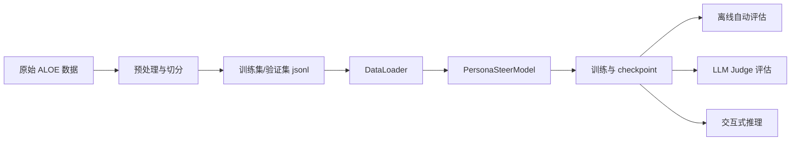

# PersonaSteer 项目运行流程说明

日期：2026-04-12
最后验证日期：2026-04-12
状态：基于当前仓库代码与文档整理

## 1. 文档目的

本文按“数据流、训练流、推理流”三个视角说明 PersonaSteer 项目是如何实际跑起来的，并补充评估流与推荐阅读路径，帮助开发者快速进入可执行层面。

## 2. 全流程概览



## 3. 数据流

### 3.1 输入数据来源

项目当前围绕 `ALOE` 数据集展开。原始数据通常位于：
- `data/aloe_raw/`

预处理后数据位于：
- `data/processed/`
- `data/split/`

预处理入口脚本位于：
- `scripts/preprocess_aloe.py:249`

### 3.2 数据预处理阶段

预处理阶段的目标通常包括：
- 清洗原始对话数据；
- 抽取用户画像、人格信息、历史轮次；
- 按训练/验证/测试划分数据；
- 写出项目内部统一格式的 `jsonl` 文件。

预处理后的样本，通常应具备下列信息：
- 用户 profile 或 persona 文本；
- 对话历史；
- 当前轮用户输入；
- 目标回复或监督信号。

### 3.3 数据加载阶段

训练与评估时，`scripts/train.py:208` 会创建数据加载器：

1. 加载 tokenizer；
2. 创建 `ALOEDataset`；
3. 使用 `PersonaSteerCollator` 组织 batch；
4. 产出 `train_loader` 与 `eval_loader`。

#### `ALOEDataset` 的职责
见 `src/data/aloe_dataset.py:13`
- 从 `jsonl` 中逐条读取样本；
- 将人格文本与对话字段组装成统一样本结构；
- 为训练与评估阶段提供样本访问接口。

#### `PersonaSteerCollator` 的职责
见 `src/data/collator.py:11`
- 将文本转换为 token；
- 补齐批次长度；
- 生成 attention mask；
- 组织模型前向传播所需字段。

### 3.4 数据流总结

```text
原始对话数据
  -> preprocess_aloe.py
  -> processed/*.jsonl
  -> ALOEDataset
  -> PersonaSteerCollator
  -> DataLoader
  -> 模型 forward/generate
```

## 4. 训练流

### 4.1 训练入口

训练主入口：`scripts/train.py:269`

执行逻辑可概括为：

```text
解析参数
  -> 读取 YAML 配置
  -> 设置随机种子
  -> 创建模型
  -> 创建数据加载器
  -> 创建训练器
  -> 如有需要加载上阶段 checkpoint
  -> 启动训练
  -> 保存最佳权重
```

### 4.2 模型创建流

模型创建入口：`scripts/train.py:108`

关键步骤如下：

1. 从 YAML 读取模型参数；
2. 通过 `AutoConfig` 获取 backbone 实际隐藏维度；
3. 构造 `PersonaSteerConfig`；
4. 加载 `AutoModelForCausalLM` 作为 backbone；
5. 复用 backbone 的 transformer 部分作为 encoder；
6. 创建 `PersonaSteerModel`；
7. 调用 `set_backbone()` 注册注入 hooks；
8. 确保 hyper network 与 injection 模块移动到目标设备。

### 4.3 PersonaSteerModel 前向主线

`PersonaSteerModel` 位于 `src/models/persona_steer.py:52`。

训练时，主线逻辑通常是：

1. 从 batch 中取得人格文本与用户文本；
2. 调用 `HyperNetwork` 生成 `v_t`；
3. 调用 `SteeringInjection.set_intervention_vector(v_t)`；
4. backbone 执行 forward；
5. 被注册的 hooks 在指定层把投影后的 `v_t` 加入 hidden states；
6. 返回 logits、loss 所需信息、gate 分布或附加统计量。

### 4.4 干预向量与门控流

#### HyperNetwork 阶段
见 `src/models/hyper_network.py:14`
- 输入：人格文本、当前 query、历史状态；
- 输出：`v_t`，可能是 `(batch, v_dim)`，也可能是 `(batch, num_layers, v_dim)`。

#### DynamicGate 阶段
见 `src/models/injection.py:35`
- 输入：`v_t`；
- 输出：每个注入层的 gate 值；
- 额外输出：entropy loss，用于训练约束。

#### SteeringInjection 阶段
见 `src/models/injection.py:100`
- 每层有一个专属 projector；
- 把 `v_t` 投影到 `layer_dim`；
- 与 gate 相乘后注入 hidden states；
- 不改动整体输入文本格式，但改变模型内部隐藏表示。

### 4.5 三阶段训练思路

根据 `README.md` 与配置命名，项目主要采用三阶段训练：

#### Stage 1：训练 HyperNetwork
- 目标：先让 steering 向量具备基本可学习能力；
- 通常冻结 backbone，仅训练较少模块。

#### Stage 2：联合训练 / 解冻 Gate
- 目标：让 gate 学会控制注入强度；
- 通常从 Stage 1 权重继续训练。

#### Stage 3：加入对比学习或更强约束
- 目标：进一步提升人格一致性与区分度；
- 通常从 Stage 2 或 Stage 1 checkpoint 恢复继续训练。

在 `scripts/train.py:269` 中可见：如果没有显式 `--resume`，代码会按 stage 自动寻找前一阶段 checkpoint。

### 4.6 训练器职责

训练器位于 `src/training/trainer.py:28`，通常负责：
- epoch / step 循环；
- optimizer 与 scheduler 管理；
- 训练 loss 与验证 loss 计算；
- checkpoint 保存；
- 最优模型追踪；
- 训练日志记录。

### 4.7 训练产物

训练后主要产物包括：
- `checkpoints/.../best.pt`
- `checkpoints/.../epoch_*.pt`
- `logs/...`
- 可能的训练统计与中间分析结果

## 5. 推理流

### 5.1 推理入口

推理演示入口：`scripts/inference.py:220`

该脚本用于交互式演示多轮人格对话，核心目的不是评估，而是快速观察模型在真实输入下的响应风格。

### 5.2 推理执行过程

推理流可以理解为：

```text
加载 checkpoint + tokenizer
  -> 输入 persona / personality 文本
  -> 输入用户当前 utterance
  -> 调用 model.generate()
      -> HyperNetwork 生成 v_t
      -> Injection 设定当前向量和 gate
      -> backbone.generate()
      -> hooks 在指定层注入
  -> 输出 assistant 回复
  -> 保留 v_t 或对话状态进入下一轮
```

### 5.3 多轮对话中的状态含义

该项目强调“多轮人格一致性”，因此推理时不仅关心单轮输入输出，还关心：
- 上一轮生成的 `v_prev` 是否被传递；
- 同一 persona 在连续多轮中的风格是否稳定；
- gate 值是否随轮次动态变化。

在部分生成脚本中可以看到 `v_t` 会在轮次之间继续传递，这反映出项目试图维持对话级别的连续 steering 状态。

### 5.4 baseline_mode

评估和部分流程中提供 `baseline_mode`，用于关闭注入模块，只让原始 backbone 生成输出。这样可以直接对比：
- 不做 steering 的基础模型；
- 做了 steering 的 PersonaSteer 模型。

这是验证方法有效性的关键对照组。

## 6. 评估流

### 6.1 评估入口

评估主入口：`scripts/evaluate.py:278`

主要流程：

1. 加载配置；
2. 从 checkpoint 恢复模型；
3. 创建评估数据加载器；
4. 运行自动指标评估；
5. 运行 LLM Judge 评估；
6. 保存结果到 `results/`。

### 6.2 自动指标评估

自动评估模块见 `src/evaluation/auto_metrics.py:20`，重点关注：
- loss
- perplexity
- gate 分布
- 其他向量统计

这类指标优点是：
- 快；
- 可批量跑；
- 可用于实验筛选。

### 6.3 LLM Judge 评估

LLM Judge 模块见 `src/evaluation/llm_judge.py:25`，主要用途是：
- 让评审模型阅读用户 profile、人格定义与完整对话；
- 按人格一致性、风格匹配等标准给分；
- 对实验模型做更接近人类偏好的评价。

仓库文档中提到至少有 V1、V2、V3 等评估范式，说明此项目在评估侧做过多轮迭代。

## 7. Probing 流

### 7.1 为什么需要 probing

PersonaSteer 并不是随便挑几层做注入，而是希望通过 probing 找到：
- 哪些层与人格表征更相关；
- 哪些层更适合注入 steering 向量；
- 注入粒度是按层还是按 head 更有效。

### 7.2 probing 模块位置

- `src/probing/attribute_extractor.py`
- `src/probing/head_probing.py`
- `src/probing/visualize.py`
- 入口：`scripts/run_probing.py:112`

### 7.3 probing 结果如何影响主流程

典型关系如下：

```text
probling 实验
  -> 识别候选注入层
  -> 写入 selected_layers 或配置文件
  -> 训练时读取 inject_layers
  -> 影响实际模型注入位置
```

因此 probing 是训练前的结构搜索步骤，而不是训练后的装饰性分析。

## 8. 开发者最实用的阅读路径

如果你的目标是“尽快跑懂项目”，建议按下列顺序：

1. `README.md`
2. `scripts/train.py:108`
3. `src/models/persona_steer.py:52`
4. `src/models/hyper_network.py:14`
5. `src/models/injection.py:35`
6. `src/models/injection.py:100`
7. `src/training/trainer.py:28`
8. `scripts/evaluate.py:121`
9. `scripts/inference.py:220`
10. `docs/analysis/known_issues.md`

## 9. 当前项目运行中的实际注意点

结合本地文档与现有仓库状态，当前需要特别注意：

1. `gate_init_bias` 曾存在硬编码问题，可能导致部分实验配置失效；
2. 配置文件较多，需先确认当前主线使用哪个 config；
3. 实验脚本存在历史版本并存情况，不能默认所有脚本都仍是主路径；
4. 文档和仓库实物存在轻微不一致，应以实际代码为主。

## 10. 一句话总结

如果你要把整个项目运行机制浓缩成一句话：

> PersonaSteer 先把人格信息编码成动态 steering 向量，再通过 gate 控制其注入大模型内部若干层，从而在训练、评估和推理中持续影响多轮对话风格与人格一致性。
